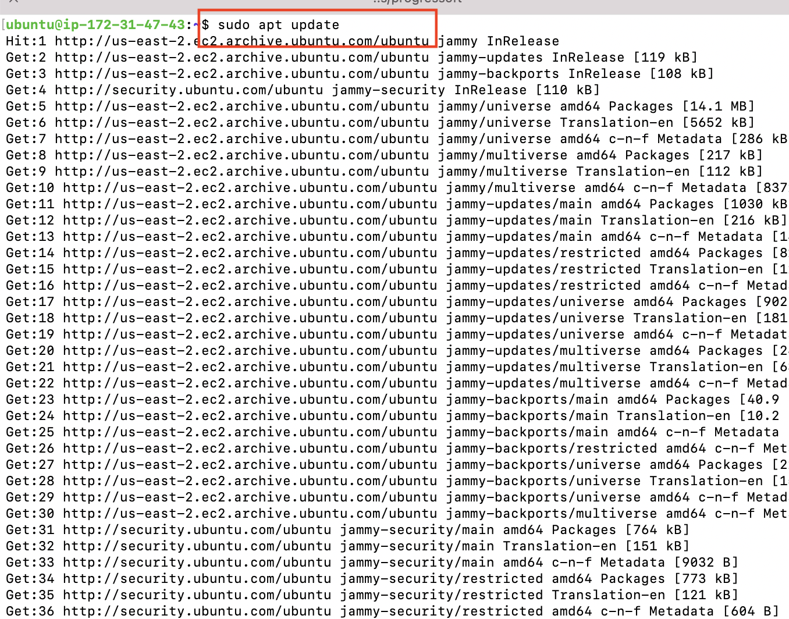
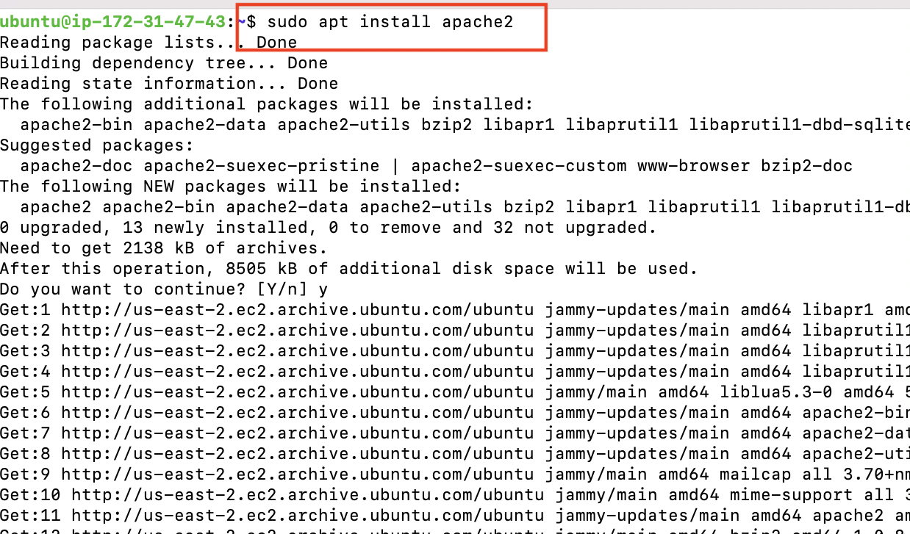
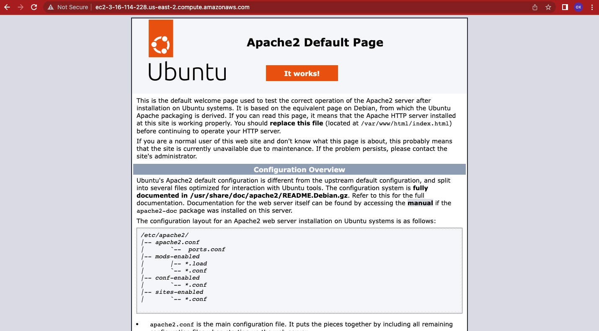
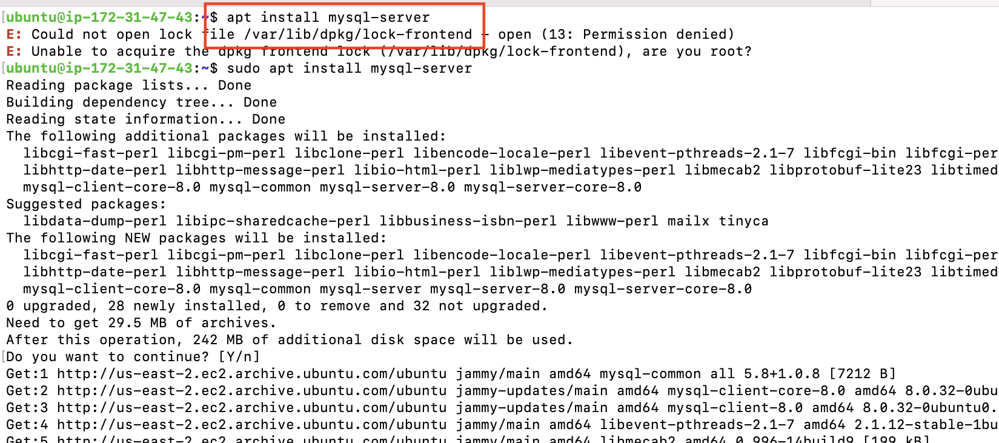
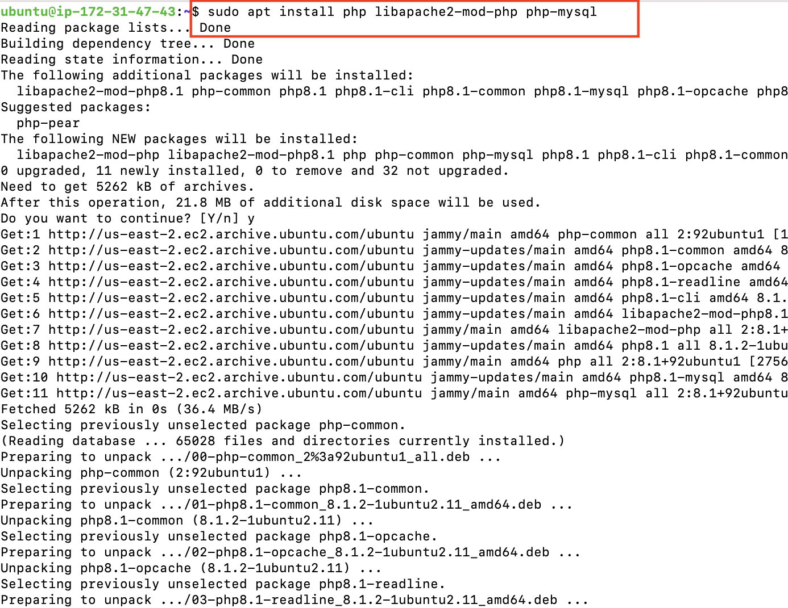
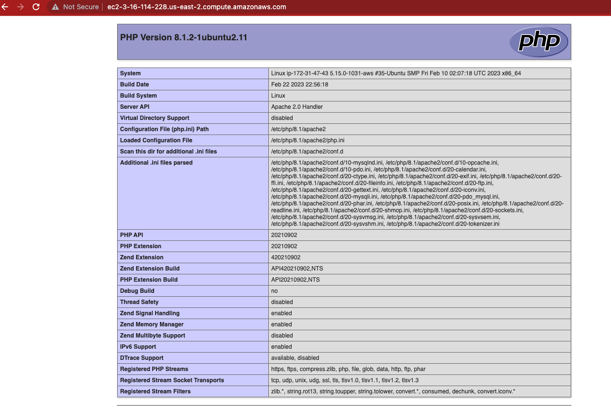

# WEB STACK IMPLEMENTATION (LAMP STACK) IN AWS

## Tech Stack

**Server:** php, apache, etc

#### Requirements

* Ubuntu instance (Any cloud service provider would do, you can deploy on your local machine, just be sure to use `localhost` in place of `public ip` or `dns` )
* php
* apache
* mysql

To spin up an instance on AWS, follow this [tutorial](https://medium.com/nerd-for-tech/how-to-create-a-ubuntu-20-04-server-on-aws-ec2-elastic-cloud-computing-5b423b5bf635 "ubuntu on aws")

##### Installing Apache2

First update all package repositories on ubuntu by running

`sudo apt update` 

Install apache web server by running:
`sudo apt install apache2`


The web server can be accessed on the web browser by opening the public IP address on the address bar or by using the dns of the linux server provided by AWS. 

##### Installing MySQL

To install MySQL, run the command `sudo apt install mysql-server`


MySql comes with default security setings which inclued, but not exclusive to, a test database, default user permissions, global access, etc. It is advised that you reconfigure the security requirements to taste.

run:

` sudo mysql`

 to open mysql terminal then run the command

`ALTER USER 'root'@'localhost' IDENTIFIED WITH mysql_native_password BY 'PassWord.1'`.

exit the current session by running `exit` and open secure installation by `sudo mysql_secure_installation`. Follow the prompt to set new password, password level, etc. Finally exit again and now you can sign in with the new password by running `sudo mysql -p`

##### Installing PHP

Php, the last piece of the installation process comes with 3 dependencies, *php* itself, *php-mysql* which is a driver that allows php to connect to mysql and libapache2-mod-php to enable apache (our webserver) handle and serve php files. These can be installed in a single command by running:
`sudo apt install php libapache2-mod-php php-mysql`


###### Creating a  new virtual host for a new website using apache

Apache is configured out of the box to serve files from the `/var/www/html/` directory, we can create a  new virtual host in the `/var/www` directory with a new name e.g `project1` by running
`sudo mkdir /var/www/project1` and give it new permissions `sudo chown -R $USER:USER /var/www/project1`

Next we create a new config file for our virtual host by running:
`vi /etc/apache2/sites-available/project1.conf`
and paste the following into the opened file:

```
<VirtualHost *:80>
    ServerName project1
    ServerAlias www.project1
    ServerAdmin webmaster@localhost
    DocumentRoot /var/www/project1
    ErrorLog ${APACHE_LOG_DIR}/error.log
    CustomLog ${APACHE_LOG_DIR}/access.log combined
</VirtualHost>
```

save and exit.

Next is to point apache server to serve our new project instead of the default, run the following commands:
`sudo a2ensite project1`
`sudo a2dissite 000-default`
Create a new file in the project directory to be served by apache server

```
sudo echo 'Hello LAMP from hostname' $(curl -s http://169.254.169.254/latest/meta-data/public-hostname) 'with public IP' $(curl -s http://169.254.169.254/latest/meta-data/public-ipv4) > /var/www/project1/index.html
```

reload the apache2 server with `sudo systemctl reload apache2` and view the page on your browser (public ip)


###### Serve php files through the webserver

To serve php files in on the web server, create a php file

```
    sudo echo '<?php
        phpinfo();' > /var/www/project1/index.php
```

also change the behaviour of apache2 to serve index.php first instead of index.html by ensuring the content of the `/etc/iapache2/mods-enabled/dir.conf` looks like the following

```
    <IfModule mod_dir.c>
        DirectoryIndex index.php index.html index.cgi index.pl index.xhtml index.htm
</IfModule>
```

**Notice index.php comes first**

Now reload the apache2 server with `sudo systemctl reload apache2` and view the page on your browser (public ip)



Thank you!

## 🔗 Reference:

* [Apache documentation](https://httpd.apache.org/docs/2.4/getting-started.html)
* [Ubuntu a2ensite manual](https://manpages.ubuntu.com/manpages/bionic/man8/a2ensite.8.html)
