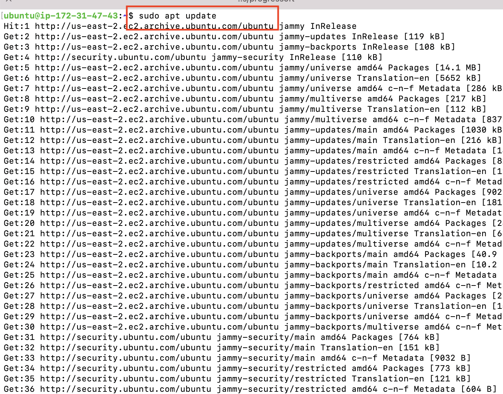
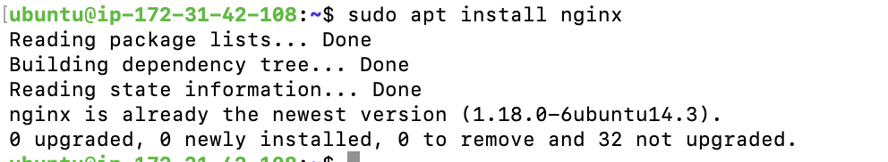
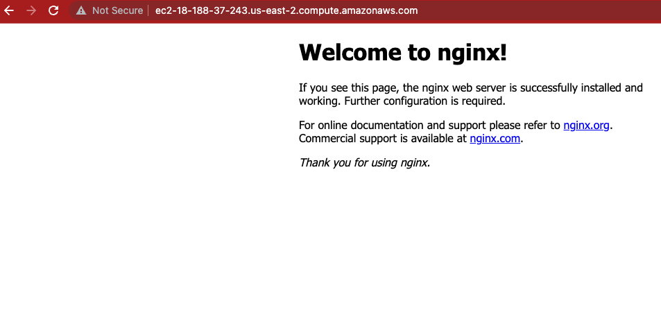
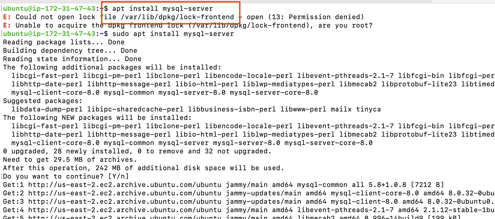
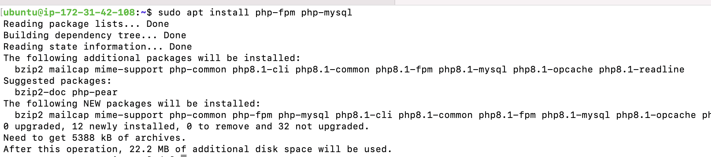
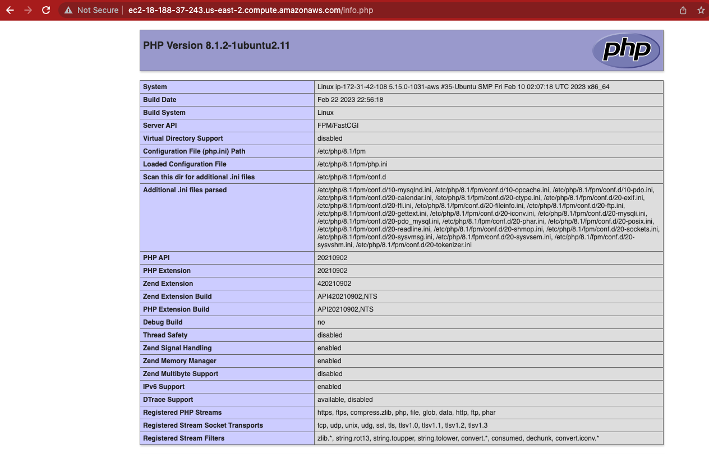
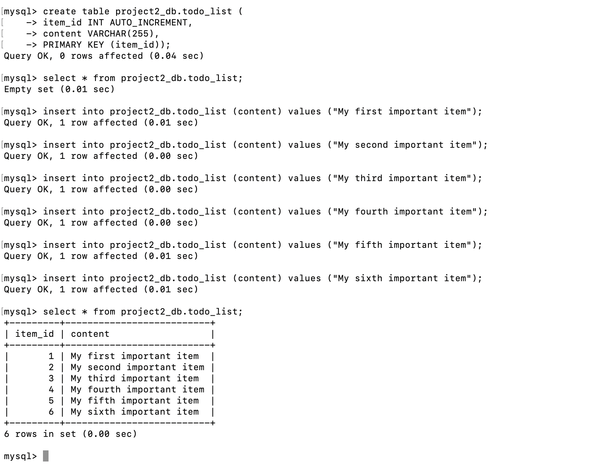
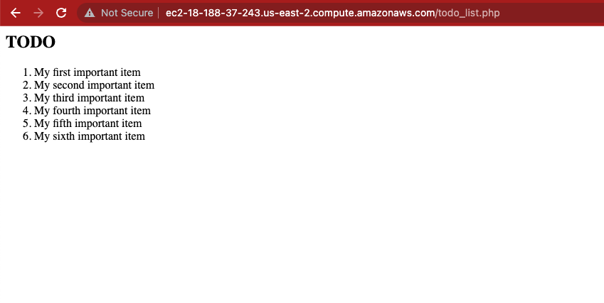

# WEB STACK IMPLEMENTATION (LEMP STACK) IN AWS

## Tech Stack

**Server:** php, nginx, etc

#### Requirements

* Ubuntu instance (Any cloud service provider would do, you can deploy on your local machine, just be sure to use `localhost` in place of `public ip` or `dns` used in this documentation )
* php
* nginx
* mysql

To spin up an instance on AWS, follow this [tutorial](https://medium.com/nerd-for-tech/how-to-create-a-ubuntu-20-04-server-on-aws-ec2-elastic-cloud-computing-5b423b5bf635 "ubuntu on aws")

##### Installing NGINX

First update all package repositories on ubuntu by running

`sudo apt update` 


Install apache web server by running:
`sudo apt install nginx`


The web server can be accessed on the web browser by opening the public IP address on the address bar or by using the dns of the linux server provided by AWS. 

##### Installing MySQL

To install MySQL, run the command `sudo apt install mysql-server`



MySql comes with default security setings which inclued, but not exclusive to, a test database, default user permissions, global access, etc. It is advised that you reconfigure the security requirements to taste.

run:

` sudo mysql`

 to open mysql terminal then run the command

`ALTER USER 'root'@'localhost' IDENTIFIED WITH mysql_native_password BY 'PassWord.1'`.

Exit the current session by running `exit` and open secure installation by `sudo mysql_secure_installation`. Follow the prompt to set new password, password level, etc. Finally exit again and now you can sign in with the new password by running `sudo mysql -p`


##### Installing PHP

Php installation comes with 3 dependencies, *php* itself, *php-mysql* which is a driver that allows php to connect to mysql and *php-fpm* nginx process and act as a bridge between the php interpreter itself and the web server. These can be installed in a single command by running:
`sudo apt install php php-fpm php-mysql`


##### Configure Nginx to use the php processor
Here we need to create a configuration that will serve as our server block for the php process. First we need to create a directory for the new web app
`sudo mkdir -p /var/www/project2` and assign this folder to the current signed in user.
`sudo chown -R $USER:$USER /var/www/project2`
Now we need to create a configuration file that to configure nginx
`sudo vi /etc/nginx/sites-available/project2`

```
#/etc/nginx/sites-available/project2

server {
    listen 80;
    server_name project2 www.project2;
    root /var/www/project2;

    index index.html index.htm index.php;

    location / {
        try_files $uri $uri/ =404;
    }

    location ~ \.php$ {
        include snippets/fastcgi-php.conf;
        fastcgi_pass unix:/var/run/php/php8.1-fpm.sock;
     }

    location ~ /\.ht {
        deny all;
    }

}
```
To Test php with nginx, create a simple php file as follows:

```
    sudo echo '<?php
        phpinfo();' > /var/www/project2/index.php
```
load the url `public-ip/index.php` on the browser 


###### Retrieving data from mysql database
Next, we create a new database, new user, and grant all permissions to the user on the database

NB: DB credentials should never be left opened like this in a public repo

```CREATE DATABASE `project2_db`;```
`CREATE USER 'lomari_user'@'%' IDENTIFIED WITH mysql_native_password BY 'SomeP@ssword1'`. be sure to use a strong password

`GRANT ALL ON project2_db.* TO 'lomari_user'@'%';`

Then login to the database as the new user by running `sudo mysql -u lomari_user -p` and enter the password.

Create a table in the database like this:
```
Create table project2_db.todo_list (
    item_id INT AUTO_INCREMENT,
    content VARCHAR(255),
    PRIMARY KEY(item_id)
);
```

Insert into the database like this:
`INSERT INTO example_database.todo_list (content) VALUES ("My first important item"); ` Do this a number of times to have multiple entries on the db table



Create a php script that will connect to the database, read the database data and present the data in html on the browser

`sudo nano /var/www/project2/todo_list.php`

Copy the following into the php script:

```
<?php
$user = "example_user";
$password = "password";
$database = "example_database";
$table = "todo_list";

try {
  $db = new PDO("mysql:host=localhost;dbname=$database", $user, $password);
  echo "<h2>TODO</h2><ol>";
  foreach($db->query("SELECT content FROM $table") as $row) {
    echo "<li>" . $row['content'] . "</li>";
  }
  echo "</ol>";
} catch (PDOException $e) {
    print "Error!: " . $e->getMessage() . "<br/>";
    die();
}
```
Save and Close.

To see the script on the browser, enter `public-ip/todo_list.php`


Thank you!

## 🔗 Reference:

* [Apache documentation](https://www.nginx.com/resources/wiki/)
* [Ubuntu a2ensite manual](https://manpages.ubuntu.com/manpages/bionic/man8/a2ensite.8.html)
