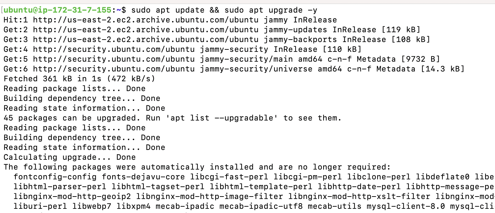
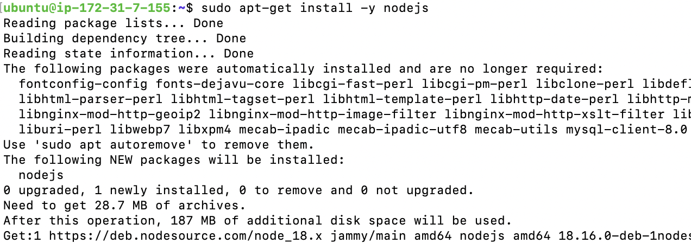

# WEB STACK IMPLEMENTATION (MERN STACK) IN AWS

## Tech Stack

MongoDB Expressjs React Node

#### Requirements

* Ubuntu instance (Any cloud service provider would do, you can deploy on your local machine, just be sure to use `localhost` in place of `public ip` or `dns` used in this documentation )
* Mongodb instance [sign up](https://www.mongodb.com/cloud/atlas/register) to get access to free hosted mongodb database.
* Nodejs: A backend javascript runtime environment that let's you write javascript on the backend [Nodejs](https://nodejs.org/en/docs). NB for this project we use Node 20 lts
* Expressjs: A nodejs framework for creating and managing routes [ExpressJS](https://expressjs.com/)
* React: A frontend library for creating user interfaces [React docs](https://react.dev/learn)

To spin up an instance on AWS, follow this [tutorial](https://medium.com/nerd-for-tech/how-to-create-a-ubuntu-20-04-server-on-aws-ec2-elastic-cloud-computing-5b423b5bf635 "ubuntu on aws")

In this project we are deploying a fullstack MERN app on AWS EC2.

### Install Node on your instance

First update all package repositories on ubuntu by running

`sudo apt update` 

We need to add nodejs ppa so sudo apt knows where to get NodeJs from, run `curl -sL https://deb.nodesource.com/setup_20.x | sudo -E bash -`

Next we install node on our machine with `sudo apt-get install nodejs`

More details are in this [tutorial](https://www.digitalocean.com/community/tutorials/install-uninstall-nodejs-ubuntu)

### Create the project folder
The project folder can be created anywhere but for this project we start with the home directory, so run `cd &&  mkdir -p Todo && cd $_` to create the project folder *Todo* and switch to the project folder

Next we create an npm project with the following command: `npm init`, name the project, the version number, license, author etc... Accept yes at the end of the
