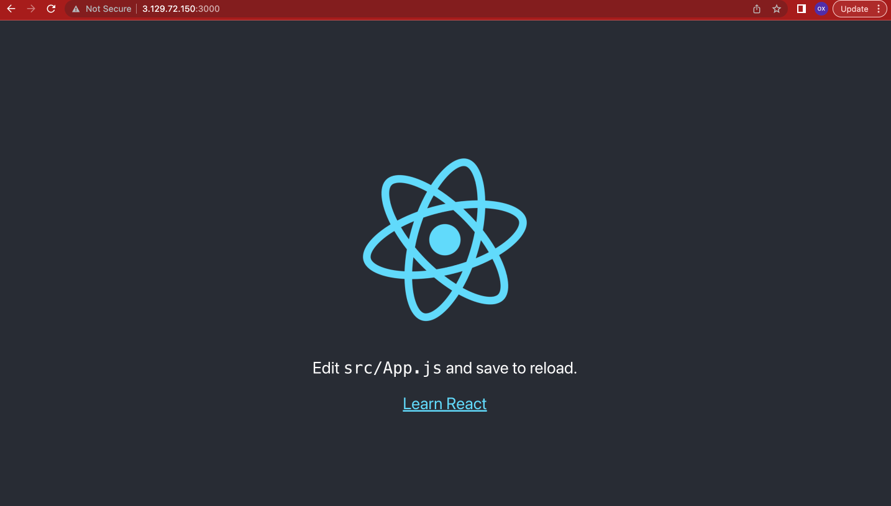

# WEB STACK IMPLEMENTATION (MERN STACK) IN AWS

## Tech Stack

MongoDB Expressjs React Node

#### Requirements

* Ubuntu instance (Any cloud service provider would do, you can deploy on your local machine, just be sure to use `localhost` in place of `public ip` or `dns` used in this documentation )
* Mongodb instance [sign up](https://www.mongodb.com/cloud/atlas/register) to get access to free hosted mongodb database.
* Nodejs: A backend javascript runtime environment that let's you write javascript on the backend [Nodejs](https://nodejs.org/en/docs). NB for this project we use Node 16
* Expressjs: A nodejs framework for creating and managing routes [ExpressJS](https://expressjs.com/)
* React: A frontend library for creating user interfaces [React docs](https://react.dev/learn)

To spin up an instance on AWS, follow this [tutorial](https://medium.com/nerd-for-tech/how-to-create-a-ubuntu-20-04-server-on-aws-ec2-elastic-cloud-computing-5b423b5bf635 "ubuntu on aws")

In this project we are deploying a fullstack MERN app on AWS EC2.

### Install Node on your instance

First update all package repositories on ubuntu by running

`sudo apt update` 


We need to add nodejs ppa so sudo apt knows where to get NodeJs from, run `curl -sL https://deb.nodesource.com/setup_16.x | sudo -E bash -`

Next we install node on our machine with `sudo apt-get install nodejs`


More details are in this [tutorial](https://www.digitalocean.com/community/tutorials/install-uninstall-nodejs-ubuntu)


### Create the project folder
The project folder can be created anywhere but for this project we start with the home directory, so run `cd &&  mkdir -p Todo && cd $_` to create the project folder *Todo* and switch to the project folder

Next we create an npm project with the following command: `npm init`, name the project, the version number, license, author etc... Accept yes at the end of the command


### Install Express

In the project folder, we install the expressjs by running `npm install express`, Also we need to install dotenv package so that we can read env files from the environment

Run `vi index.js` paste the following into it and save

```
const express = require('express');
require('dotenv').config();

const app = express();

const port = process.env.PORT || 5000;

app.use((req, res, next) => {
res.header("Access-Control-Allow-Origin", "\*");
res.header("Access-Control-Allow-Headers", "Origin, X-Requested-With, Content-Type, Accept");
next();
});

app.use((req, res, next) => {
res.send('Welcome to Express');
});

app.listen(port, () => {
console.log(`Server running on port ${port}`)
});
```

run `node index.js` to start the Express server on port 5000. Head over to AWS to edit inbound rules so you can access the server from a client. If you're runnning a local instance, then you can access the server from `localhost:5000`


To access the server get the public ip address/dns of the instance and add the port :5000. e.g *ip:5000*


Next we add routes to the express server and for the sake of brievity, js code for this won't be included in the documentation


### Connecting to Mongodb
To connect to mongodb you need to install the mongodb package called mongoose
run: `npm install mongoose`

Create Models by running the following
`mkdir models && cd $_ && vi todo.js`
paste the following code snippet into the file

```
const mongoose = require('mongoose');
const Schema = mongoose.Schema;

//create schema for todo
const TodoSchema = new Schema({
action: {
type: String,
required: [true, 'The todo text field is required']
}
})

//create model for todo
const Todo = mongoose.model('todo', TodoSchema);

module.exports = Todo;
```

update the routes (skipped)

On mongodb atlas, sign in with your credentials and create a new database instance


Next thing is to configure the database access credentials and network access too.


On the create database tab, create a new database user and assign the role to enable the user read and write access and save. On the network access tab, create a new network policy to allow access from any ipaddress.

Now to get the connection string to the db, go to the database dashboard for the  new database you just created and click on connect, select the connect through drivers option, choose nodejs on the next page and you will be presented with the connection string


next step is to use the connection string to connect the app to the database, inside the Todo folder, run `vi .env` create a new variable called DB and assign the connection string to it (edit the username and password to the credentials you created for the new database user), exit and save.

Update the index.js file and start the node server again

```
const express = require('express');
const bodyParser = require('body-parser');
const mongoose = require('mongoose');
const routes = require('./routes/api');
const path = require('path');
require('dotenv').config();

const app = express();

const port = process.env.PORT || 5000;

//connect to the database
mongoose.connect(process.env.DB, { useNewUrlParser: true, useUnifiedTopology: true })
.then(() => console.log(`Database connected successfully`))
.catch(err => console.log(err));

//since mongoose promise is depreciated, we overide it with node's promise
mongoose.Promise = global.Promise;

app.use((req, res, next) => {
res.header("Access-Control-Allow-Origin", "\*");
res.header("Access-Control-Allow-Headers", "Origin, X-Requested-With, Content-Type, Accept");
next();
});

app.use(bodyParser.json());

app.use('/api', routes);

app.use((err, req, res, next) => {
console.log(err);
next();
});

app.listen(port, () => {
console.log(`Server running on port ${port}`)
});
```

Now we can make rest calls to the backend server through a client, e.g postman, to create a todo, get all existing todos, and delete them too


### Creating the client

Again, navigate to the home directory and run `npx create-react-app client` this will create a react project called client and all dependencies. you can start the client app by running `npm start`



open the client directory and run `vi package.json` add a new json entry to the file `"proxy": "http://localhost:5000"` and save, (url to the backend server), this enty just tells the frontend development server to forward any unknown request to the url specified. Lastly, within the client directory we need to install axios, a library that will help us make http requests to the backend server.

`npm install axios`

Move the client app directory into the Todo directory `mv client todo/ && rm -rf client`

In the Todo directory we need to install two more dependencies, nodemon and concurrently, the former to restart the app everytime there's a change and the latter will enable us run multiple commands concurrently.

`npm i --save-dev nodemon concurrently`

Next, update the npm scripts in package.json to look like the following
```
"scripts": {
"start": "node index.js",
"start-watch": "nodemon index.js",
"dev": "concurrently \"npm run start-watch\" \"cd client && npm start\""
},
```

Update the client side code snippets to enable add new todo, delete a todo on click and also to get all the todos

In the *Todo* directory, run `npm run dev` to start both the backend server and the client (with concurrently, as specified in the script)


Now that both backend and frontend apps are running, you need to edit the inbound rules on your ec2 instance to allow inbound traffic on port 3000. Finally, Visit  *`ipaddress:3000`* to see the project, you can create a new todo, delete a todo on click and all available todos are listed on the page too.


Thanks!!!