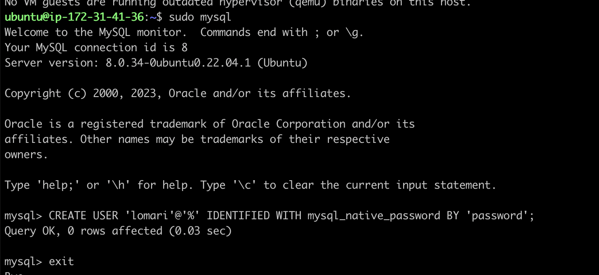

# CLIENT-SERVER ARCHITECTURE

## Tech Stack

* AWS EC2
* Mysql

#### Requirements

* Ubuntu instance
* Mysql Server
* MySql Client

To spin up an instance on AWS, follow this [tutorial](https://medium.com/nerd-for-tech/how-to-create-a-ubuntu-20-04-server-on-aws-ec2-elastic-cloud-computing-5b423b5bf635 "ubuntu on aws")

In this project we are demonstrating a basic client-server using MySQL Relational Database Management System (RDBMS).

## Setup

We are going to spin up two Ubuntu instances on AWS, and call one the server, and the other instance the client.


On both instances, update apt as follows:

`sudo apt update`


##### Server configurations

ssh into the server instance and install mysql-server by running

```bash
sudo apt install mysql-server
```


Next edit the server configurations file to allow connections from other host apart from localhost,

```
/etc/mysql/mysql.conf.d/mysqld.cnf
```


change the value of the bind address from `127.0.0.1` to `0.0.0.0`

### Client Config

On the client, install mysql client by running

```
sudo apt install mysql-client
```


After this installation, we need to edit security groups on the server instance to allow connections from the client, for this we need to tell the server to accept tcp connection only from the private ip-address of the client. This is possible because both the server and the client are in thesame virtual private network (VPC)


### Create MySQL user

Next thing is to create the user account on the server instance, this is needed so the client instance can connect to the server



Also we are going to create a database on the server that the new user can access from the client


Next we grant the user privileges on the database by running `GRANT ALL ON demo_db.* TO 'lomari'@'%';`

### Connect to server

Finally we need to connect to the mysql server from the client instance, to do that we run `mysql -u username -p -h <server private ip>`


Finally show the databases the user has access to on the client by running `show databases`


Thanks!!!
